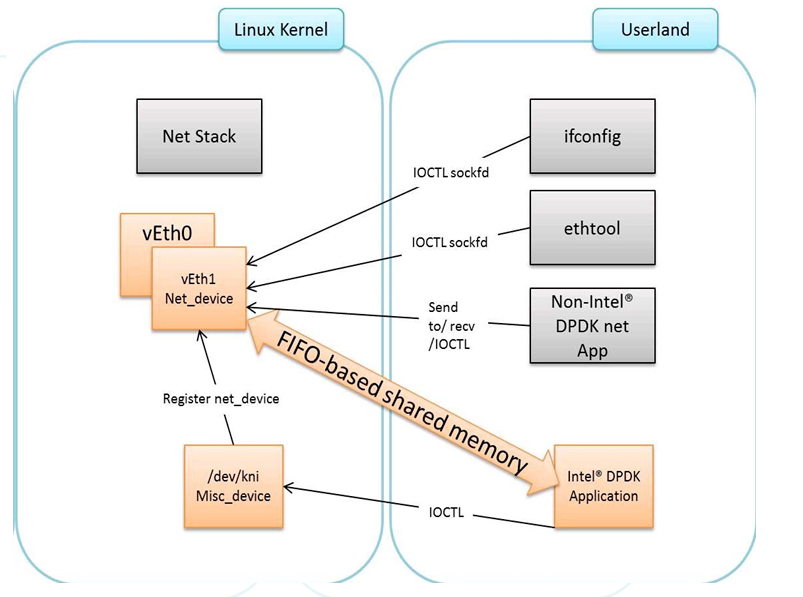

# kni  （kernel networki nterface） (Kernel NIC Interface)

## 作用
- 将 dpdk 不感兴趣的数据包或者到本地的数据包发送到内核

- dpdk通过什么方式将报文转发给内核呢？ 可以通过kni设备，也可以通过tun/tap虚拟网卡来实现。 相对于tun/tap实现， kni减少了内核态与应用层之间内存拷贝的操作，具有更高的转发性能。

## kni实现原理
- kni 分为内核模块和 应用程序部分

	- 内核模块为 rte_kni.ko, 他创建了一个 /dev/kni 混合设备， 可以接收应用层的ioctl消息， 按需来创建各种kni设备、删除kni设备、打开kni设备、关闭kni设备、设置mtu、接收ethtool工具的命令操作消息等等。
	- 应用层可以通过 ioctl 来向 kni 发送消息， 通过 ioctl 来创建 kni设备（vethx）;

	- 驱动层创建的两种设备，一个是/dev/kni混合设备， 另一个是kni设备，这两个是不同的设备类型。



### kni 内核模块

- 1 注册了一个 杂项设备， kni
```cpp
#define KNI_DEVICE "kni"
static struct miscdevice kni_misc = {
	.minor = MISC_DYNAMIC_MINOR,
	.name = KNI_DEVICE,
	.fops = &kni_fops,
};
misc_register(&kni_misc);
static const struct file_operations kni_fops = {
	.owner = THIS_MODULE,
	.open = kni_open,
	.release = kni_release,
	.unlocked_ioctl = (void *)kni_ioctl,
	.compat_ioctl = (void *)kni_compat_ioctl,
};
```

### kni 应用程序
- 对于每一个网卡，都可以创建一个或者多个kni设备。具体每一张网卡可以创建多少个kni设备，由应用层自行指定。
		创建完kni设备后，ifconfig -a命令执行后就可以看到这些虚拟网卡名，例如veth1_0, veth1_1。
		如果加载驱动的时候，指定了单线程模型，则kni驱动将只会创建一个线程，用于所有的kni设备接收来自应用层的报文。 
		如果加载kni驱动的时候，指定了多线程模型，则对于每个kni设备，kni驱动都会创建一个线程去接收来自应用层发来的报文。 
		kni设备与线程是一一对应的关系。

- 应用层使用一个struct rte_kni_memzone_slot数组来存放所有的kni设备， 每个数组元素对应一个kni设备。 
		每个kni设备本身，都有一个独占的发送队列、接收队列、分配队列、释放队列、请求队列、响应队列。
		需要注意的是m_ctx成员指向的struct rte_kni结构本身，内部也有各种队列，但这些都是一个指针，指向刚才提到的些队列，是一种引用关系，而不会为它重复开辟这些队列空间。
	
- 当应用层从网卡收到报文后，将报文放到kni设备的rx接收队队列。kni驱动就会从这个rx接收队列中取出mbuf报文，将mbuf报文转为内核协议栈支持的sk_buff，调用netif_rx内核接口发给内核。
		将报文发给内核后，会将这些mbuf报文放到free释放队列，由应用层读取释放队列中待释放的mbuf进行释放操作。为
	
- 当kni驱动收到来自内核的报文后，会调用 kni_net_tx从malloc 分配队列中获取一个应用层已经分配好的mbuf结构。同时将sk_buff报文转为mbuf报文，存放到mbuf中。之后将mbuf报文发到tx发送队列中。
		应用层从tx发送队列中获取报文后，将报文通过网卡发送出去。
	
- 请求与发送队列: 当应用层调用ifconfig, ethtool等工具，设置kni设备的mtu, 使得kni设备up/down的时候。kni驱动收到这些设置操作，会构造一个请求报文，将这个请求报文放到req请求队列。
		应用层就会从这个req请求队列中获取一个请求，执行这个请求操作。例如设置mtu, 使得网卡up等。
		应用层会调用pmd用户态驱动实现的接口，来真正的对网卡设置mtu， 使得网卡up等操作。之后应用层会构造一个响应消息，将消息放到resp队列中，驱动从这个resp队列中获取响应消息就知道请求的执行结果了。
	


## tun虚拟网卡拓展

- tun虚拟网卡方式。这其实和kni操作是差不多的。dpdk提供了exception_path例子来介绍tun的使用。首先应用层打开/dev/net/tun设备，然后通过往这个/dev/net/tun设备发送ioctl消息， 内核接收到ioctl消息后创建虚拟网卡。这和kni设备的创建是不是很相似，kni设备是通过往/dev/kni混合设备发ioctl消息来创建kni设备的。在创建完虚拟网卡后，也可以和kni设备执行类似的操作。例如ifconfig配置tun虚拟网卡ip, ethtool设置虚拟网卡信息，tcpdump抓包等。

