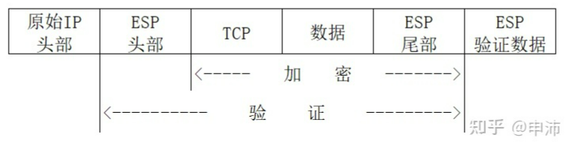

# 控制面


## 协商

### ikev1  （SA-KE-AUTH）

- 主模式
    1-2：   交换SA配置
    3-4：   交换密钥
    5-6：   身份认证

- 野蛮模式
    1:      发起端SA配置/交换密钥/身份
    2：     响应端SA配置/交换密钥/身份认证
    3：     发起端认证响应身份

- 快速模式
    1：     发起端SA配置/交换密钥/流量选择符（ikev1中u欧维一种身份）
    2：     发起端SA配置/交换密钥/流量选择符/身份确认
    3：     身份确认
 


- 5、秘钥有效期lifetime

    ipsec秘钥周期性更新，默认3600s(1小时)，一个lifetime内SPI保持不变。
    PFS(Prefect forward security)，启用后每一个周期结束时，展开一次全新的DH交; 不开启的话，每个周期结束后根据上一次的密钥计算下一次的密钥；


### ikev2
    第一阶段2个包， IKE_SA_INIT交换
    第二阶段2个包； IKE_AUTH交换
    每增加一对加密数据流需要2个包协商； 


# 数据面

```
    ipc: 
        作用： 与控制面交互
        实现： 
            （1） 内核模式下， 可以注册杂项设备， 使用ioctrl 实现； 数据面需要主动发起的 可以使用 netlink；
            （2） dpdk模式下， 可以使用共享内存；
 

    内网包入口：
        实现： 通过系统路由实现， 隧道创建成功后，添加系统路由；

    
    封包发出：
        实现：
            隧道模式：  
                esp:        IPV4/IPV6/L4 | --> | IPV4 | ESP | IV | ENC(next[IPV4/IPV6/L4]) | ESP_TAIL | HASH(ESP+IV+ENC(next)+ESP_TAIL) |
                ah:         IPV4/IPV6/L4 | --> | IPV4 | AH | HASH(IPV4+AH+PAYLOAD(next)) | PAYLOAD(IPV4/IPV6/L4) |
                esp+udp:    IPV4/IPV6/L4 | --> | IPV4 | UDP | ESP | IV | ENC(next[IPV4/IPV6/L4]) | ESP_TAIL | HASH(ESP+IV+ENC(next)+ESP_TAIL) |
                
                ah无法穿越NAT： 因为AH封装，也校验IP报头，在穿越NAT设备时，源地址会被转换，相当于篡改数据，导致接收端丢弃数据。
            
            传输模式：
                esp:        IPV4/IPV6 | L4 | --> | IPV4/IPV6 | ESP | ENC(L4) | ESP_TAIL | HASH(ESP+ENC(L4)+ESP_TAIL) |
                ah:         IPV4/IPV6 | L4 | --> | IPV4/IPV6 | AH | HASH(IP+AH+L4) |  L4 |

    封包接收：
        实现：
            （1） 内核模式下， 注册 netfilter 钩子， 通过协议(esp/ah)或者端口(4500)以及spi 确认是否是 ipsec的数据包；
            （2） dpdk模式下， 同样注册插件， 首包检查是ipsec的数据流后， 打上标记， 后续包走快路；

        注意：
            （1） 4500的协商包和数据包区分
                当使用4500承载的时候，IKE报文头与UDP报文头之间，会插入4个字节的0，用来区分ESP报文和IKE报文。
                4500 协商包， IKE报文头与UDP报文头之间，会插入4个字节的0
        


    原始包输出：


    rss 软分发：

    组播广播：  不支持

```


# ikev1 和 ikev2 的区别
- 1、协商过程不同： 
    ikev1 分主模式和野蛮模式， 
        主模式第一阶段6个包， 第二阶段3个包；
        野蛮模式第一阶段3个包，第二阶段3个包； 第一阶段密钥交换和身份认证是一起发送的，无法提供身份保护； 一般用于对端动态ip；
        第二阶段每增加一对加密数据流需要3个包协商；
    ikev2 只有主模式
        第一阶段2个包， IKE_SA_INIT交换
        第二阶段2个包； IKE_AUTH交换
        每增加一对加密数据流需要2个包协商； 
        并且v2可以合并加密数据流，多条一起协商； v2的加密数据流可以不一致，只要有包含关系就行；
    
    ikev2 简化了协商过程

- 2、认证方法不同：
        ikev2 提供 EAP 认证，可以借助认证服务器对原创PC，手机等进行认证；
        ikev1 没有此功能，必须借助  l2tp;

- 3、v1 中 prf不可配置， v2需要配置； （prf: 伪随机算法）


 
 

# 其他
[IPSec协议抓包详解和IPSec NAT穿越报文解析](https://blog.csdn.net/ever_peng/article/details/89217263)


